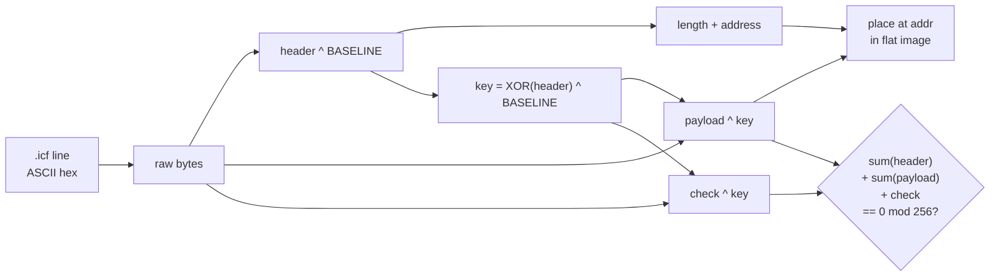

# Retevis RA89R ICF to binary converter

Vibe coded script (ra89r) in python that converts a .icf firmware from a Retevis RA89R to a binary that you can modify with ghidra and then allows you to convert it back to a .icf

The bootloader of the Retevis has a validator  (more details below) so I attached the bootloader.bin file if you want to inspect it. 
To extract the bootloader a custom firmware was made that dumped that part of the code.  

To read a firmware binary with ghidra you need to put:

```
Processor: ARM  
Variant: Cortex  
Size: 32  
Endian: little  
Compiler: default  
Base Address: 0x08000000  
```

Retevis MCU: Puya PY32F403

----------------------------

# icf-tool — decoding the `.icf` firmware container

A Python codec for the `.icf` firmware files used by a family of Chinese
handheld and mobile radios, and a write-up of how the format was reverse
engineered so the same method can be applied to other radios that use it.

Confirmed working on:

| Radio | Baseline | Files tested | Records |
|---|---|---|---|
| Retevis RA89R | `0x66` | V49, V52 | 144 |
| TYT UV8800 | `0x88` | V118, V121, V131, V1263 | 236 |
| TYT TH9000D | `0x90` | 2022, V121, V123 | 230 |

**610 records, 9 stock firmware files, 3 radio families — every record
validates, zero exceptions.** Every file round-trips decode → encode
byte-identically.

---

## What the tool does

```bash
python ra89r.py decode firmware.icf firmware.bin   # container -> flat image
#   edit firmware.bin in place; the size must not change
python ra89r.py encode firmware.bin patched.icf    # image -> container

python ra89r.py verify firmware.icf                # check every record
python ra89r.py info   firmware.icf                # record table
```

`decode` writes a small sidecar next to the `.bin` holding each record's
header, so `encode` rebuilds the file byte-for-byte. Without the sidecar,
`encode --like original.icf` copies the record layout from any file for the
same radio.

There is no calibration step, no lookup table and no guessing. The check byte
is computed.

---

## The format

An `.icf` is ASCII hex text, one record per line, separated by `CR` (`0x0D`).
Each record decodes to:

```
[ 6-byte header ][ payload ][ 1 check byte ]
```

Every byte of the header is XORed with a per-family **baseline** constant.
Everything after the header is XORed with a **per-record key** derived from
the header:

```python
h      = [raw[i] ^ BASELINE for i in range(6)]      # decoded header
length = (h[0] << 8) | h[1]                          # payload size in bytes
addr   = ((h[2] << 16) | (h[3] << 8) | h[4]) * 0x100 # destination in flash
key    = h[0]^h[1]^h[2]^h[3]^h[4]^h[5] ^ BASELINE

payload = [b ^ key for b in raw_payload]
check   = raw_check ^ key                            # the check byte is
                                                     # encrypted too
```

A record is valid exactly when

```
( sum(h[0:6]) + sum(payload) + check )  mod 256  ==  0
```

so the byte to store is

```python
raw_check = key ^ ( -(sum(h) + sum(payload)) % 256 )
```

That's the whole format. An 8-bit sum that has to come out zero.



### Things worth knowing

**Records are self-addressing.** The header carries the destination address,
and the bootloader honours it — file order does not matter. This is verified
on hardware: a stock file with one record moved to the front flashes and boots
normally. It is the single most useful property of the format (see
[Brute force](#appendix-brute-forcing-the-check-byte-without-the-bootloader)).

**The image is not based at `0x08000000`.** On the RA89R the first record's
address field reads `0x08004000`, and the reset vector inside it is
`0x08004145`. The file spans `0x08004000`–`0x0802796C`. The 16 KB below it is
the resident bootloader and is **not in the file** — which is exactly why the
check byte cannot be read out of the application image.

**The last record is short.** On the RA89R it carries 364 bytes, and its
length field reads `0x016C` = 364. That record is the quickest sanity check
that your baseline guess is right.

**The key is the XOR of all six header bytes**, not just two. For full-size
records `h[0]`, `h[1]`, `h[2]` and `h[5]` are constant so a two-byte shortcut
appears to work — and then silently decodes the short final record with the
wrong key. This bug survived a long time here; check your short record.

---

## Porting to another radio

### Step 1 — confirm the container shape

Split the file on `CR`; if that yields fewer pieces than splitting on `LF`,
use `LF`. Each line should be an even number of hex characters and almost all
lines should be the same length. Record size minus 7 is your payload size
candidate.

### Step 2 — brute-force the baseline

This needs no knowledge of the checksum at all. For each of the 256 possible
baselines, decode every header and check that `(h[0] << 8) | h[1]` equals the
record's actual payload length. Exactly one value will satisfy every record,
including the short one.

```python
for bl in range(256):
    if all(((r[0]^bl) << 8 | (r[1]^bl)) == len(r) - 7 for r in records):
        baseline = bl
```

`ra89r.py` does this automatically and also tries `0x66`, `0x88` and `0x90`
first. If a new radio turns up a fourth value, add it to `KNOWN_BASELINES`.

### Step 3 — test the checksum rule

Run `verify`. If every record sums to zero, you are done — the codec works and
you can start patching.

### Step 4 — if it doesn't, get the bootloader

The rule above may be family-specific. If `verify` fails, the algorithm lives
in the bootloader, and the bootloader is reachable. See the next section.

---

## How the checksum was actually found

Worth reading before you start guessing, because the guessing phase cost
weeks and produced nothing.

### What did not work

The trailing byte was assumed to be a checksum over the payload and attacked
directly. Ruled out by exhaustive test against stock firmware:

- `sum8` and `xor8` of the payload, in both raw and decoded domains
- negated `sum8`, one's-complement (`mod 255`) sums
- all 256 CRC-8 polynomials × both bit orders × the header included or not
- polynomials in the byte value up to degree 7
- bit-plane weights with a constant term (62 of 71 records contradict it)
- every odd multiplicative hash, every prefix length, forward and reverse
- a per-value lookup table `g`, fitted from same-header record pairs

The lookup-table model was the most seductive and the most wrong. It fitted
71 equations with 71 pivots — **zero redundancy**, so it could not fail, and
fitting it proved nothing. It also produced a bogus "different radios use
different tables" conclusion. If your model has as many free parameters as
equations, you have not tested it.

**The reason none of it worked: the check byte is XORed with the per-record
key, like every other byte after the header.** Read as plaintext, an ordinary
8-bit sum looks like a value-dependent hash, because the key aliases it
differently in every record. One missing XOR produced every dead end above.

### Getting the bootloader out

The validator lives in the 16 KB at `0x08000000` that the `.icf` never
touches. On an STM32 with read protection level 1, a debugger cannot read
flash — **but the CPU can.** The firmware is yours to modify, so give it a
reason to read its own bootloader out of the serial port.

On the RA89R this was a 15-byte patch. The update handler compares five bytes
against `"Reset"` and switches on the next byte — `'0'` normal update, `'3'`
alternate, `'C'` **mass erase**. Replacing the `'C'` arm both removes a
footgun and provides the hook:

```asm
ldrb  r1, [r4, #0xb]        ; chunk index from the request packet
lsls  r0, r1, #6            ; * 64
orr.w r0, r0, #0x08000000   ; -> 0x08000000 + index*64
movs  r1, #0x40             ; 64 bytes
bl    <raw UART send>
b     <return>              ; skip the system reset the other arms fall into
```

That last line matters: the `'0'` and `'3'` arms end in an `AIRCR` reset, so
skipping it lets the radio answer 256 requests in a row instead of one per
boot. 16 KB at a time, about 30 seconds.

The request frame, for reference — the same escaping the updater uses:

```
FE FE EE EF E5 <escaped payload> FD

payload before escaping:  "Reset" 'D' <index> <checksum>
checksum = 8-bit sum of the preceding payload bytes

escaping, per byte D:
    0x7D <= D <= 0x7F  ->  FF, (D - 0x70) & 0xFF
    otherwise          ->  (D + 0x80) & 0xFF
```

The three escaped values are exactly those whose single-byte form would
collide with the `FD`/`FE`/`FF` framing bytes.

**Baud rate:** the radio's normal serial port is *not* at the 9600 the
firmware updater uses — the updater switches to it explicitly. Probe for it.
Command `0xE0` with the tag `"RA89"` is an identify that answers on any
firmware including stock, which makes it a perfect link test.

### The answer

Twelve instructions at `0x08000BE0`:

```asm
bl   <get length>        ; length = (h[0]<<8) | h[1]
bl   <decrypt>           ; header, payload AND check byte
r6 = 0
for i in 0 .. length+6:  r6 = (r6 + buf[i+5]) & 0xFF
cbnz r6, reject
```

It sums `length + 7` bytes starting at the header — 6 header + `length`
payload + 1 check — and requires zero.

---

## Appendix: brute-forcing the check byte without the bootloader

If you cannot get the bootloader, the check byte can be found on hardware.
This is how the first few patches here were built, before the algorithm was
known. It is slow but it always terminates.

1. **Halve the search space with parity.** Whatever the rule, `check & 1`
   tracks `sum(payload) & 1` in every stock record. 128 candidates, not 256.

2. **Put the modified record first.** Because records are self-addressing,
   moving the one you changed to file position 1 means a wrong check byte
   aborts the transfer at ~3% instead of ~60%. Roughly 10 seconds per attempt
   instead of two minutes — a 20× speedup, and it is what makes this
   practical at all.

3. **Order candidates by a prior.** Compute `check - sum(decoded payload)` for
   every record of every stock file you have. The distribution is sharply
   peaked; on the RA89R one value accounted for 33 of 142 records. Ranking
   candidates by that frequency put the answer in the first handful about half
   the time.

4. **Small patches are predictable.** `Δcheck = Δ(byte sum) + 2 × Δ(odd-byte
   count)` was exact for every change of a few bytes. It breaks down somewhere
   between 2 and 15 bytes changed, so treat it as a first guess, not a rule.

Once the real algorithm is known, all of this is obsolete — which is the
point of getting the bootloader.

---

## Safety

Recovery has never failed here: the bootloader lives in a separate flash
region that the `.icf` cannot touch, so a bad image is always recoverable by
power-cycling into update mode and flashing stock. Keep a known-good stock
`.icf` before you start.

Two things that are genuinely dangerous and not recoverable:

- **Never send command byte `'C'`** over the update protocol. It triggers a
  mass erase by dropping the chip to read-protection level 0.
- **Do not attempt an SWD readout to bypass protection.** Read protection is
  re-armed on every boot; clearing it mass-erases the chip, and the `.icf` is
  not a full flash image, so you cannot put back what you lose.

If you patch anything that affects transmit: use a dummy load, start at the
lowest power, keep transmissions short, and measure before going on air.
Widening band limits or bypassing power calibration can push the PA outside
its safe operating area and will produce emissions that do not meet the
radio's type approval. That is your responsibility, not the tool's.


